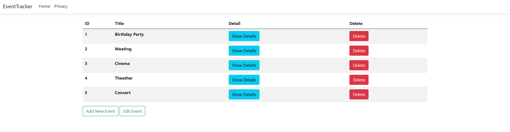

# Event Tracking Application - ASP.NET Core MVC

## Objective:
The goal of this project is to develop a basic event tracking application using ASP.NET Core MVC, which includes fundamental CRUD (Create, Read, Update, Delete) operations. The application will allow users to manage events, including viewing event details, creating new events, editing existing ones, and deleting events.

## Screenshot

## Features:
- Create, read, update, and delete events.
- Display a list of events with options to view details and delete events.
- Create a new event and edit the existing event’s information.

## Tasks:

1. **Project Setup:**
   - Create a new ASP.NET Core MVC project.
   - Project Name: `EventTracker`

2. **Create Event Model and Implement CRUD Operations:**
   - Inside the `Models` folder, create a class called `EventModel`:
     - Properties: `Id`, `Title`, `Description`, `Date`
   
   - Inside the `Controllers` folder, create an `EventsController`:
     - Implement action methods for CRUD operations:
       - `List`: To list all events.
       - `Details`: To view the details of a specific event.
       - `Create`: To add a new event.
       - `Edit`: To modify an existing event.
       - `Delete`: To remove an event.

3. **Define Event List:**
   - Inside `EventsController`, define a simple static list to manage events.
   - Initialize this list with two sample events for demonstration purposes
  
4. **Create Views:**
     - List View: Inside the Views/Events folder, create a List.cshtml view:
       - Display the events in a table format.
       - Include "Details" and "Delete" buttons for each event.

    - Details View: Inside the Views/Events folder, create a Details.cshtml view:
       - Display the full details of a selected event.
       - Include a "Back" button to return to the event list.
     
    - Create View: Inside the Views/Events folder, create a Create.cshtml view:
       - Include a form for creating new events, with fields for Title, Description, and Date.

    - Edit View: Inside the Views/Events folder, create an Edit.cshtml view:
       - Include a form to edit the details of an existing event.

## Technologies Used:
- ASP.NET Core MVC
- C#
- Razor Views
- HTML Forms
